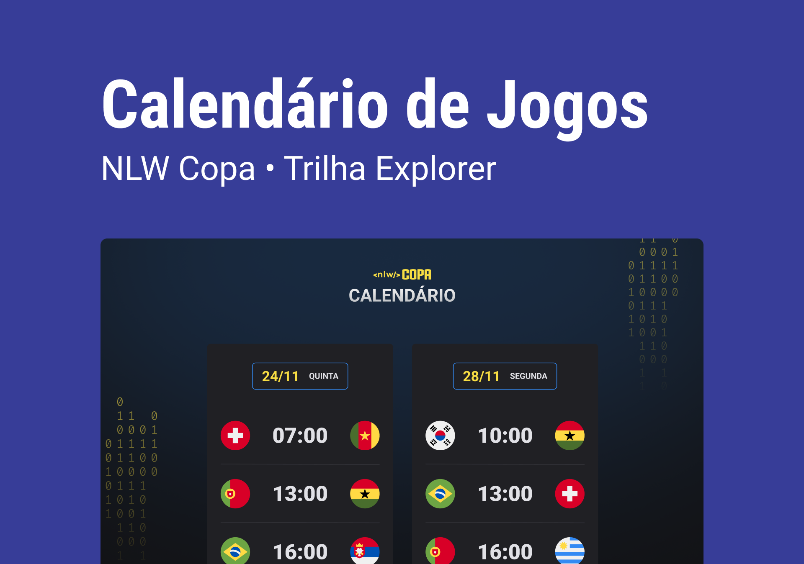

<h1 align ="center"> NLW #10 Copa </h1>

  

    Evento exclusivo e gratuito, promovido pela Rocketseat
    para ensino de tecnologias WEB.

  
Licença MIT

  

  
 

  
 

 
  ## 🚀 tecnologias
    
    Esse projeto foi desenvolvido com as seguintes tecnologias:

    -HTML e CSS
    -JavaScript
    -Git e Github

 ## 💻 Projeto
  O Calendário da Copa é um projeto que mostra os jogos da copa de 2022.

  ## 🔖 Layout
  Você pode visualizar o layout do projeto através <a href="https://www.figma.com/file/HmrTaaLjYiUVvO8xFgQERD/Calend%C3%A1rio-de-Jogos-(Community)?node-id=0%3A1">DESSE LINK</a>. É necessário ter conta no Figma para acessá-lo.

  ## 📝 Licença
  Esse projeto está sob a licença MIT.
